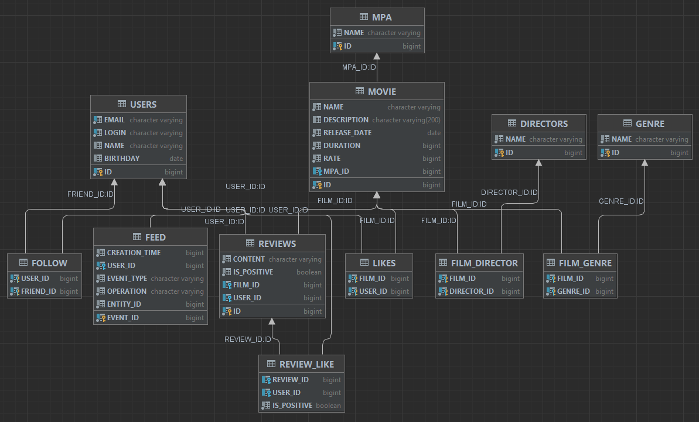

## Filmorate :film_projector:

Group project to create an application for movie lovers and communication.

Added new functionality during a group project:
- Reviews
- Search
- Shared Movies
- Recommendations
- Event Feed
- Delete movies and users
- Add directors to movies
- Display the most popular movies by genre and year

---

### _Development:_
 
 -  Java 11
 -  To work with the database used: [JdbcTemplate](https://github.com/Elizaveta-shapovalova/java-filmorate/blob/main/src/main/java/ru/yandex/practicum/filmorate/storage/film/FilmDbStorage.java).
 - For validation was used: Lombok with [Interfaces](https://github.com/Elizaveta-shapovalova/java-filmorate/blob/main/src/main/java/ru/yandex/practicum/filmorate/model/film/Film.java) for separation of field validation and custom [Annotation](https://github.com/Elizaveta-shapovalova/java-filmorate/blob/main/src/main/java/ru/yandex/practicum/filmorate/validation/film/FilmReleaseDateConstraint.java).
 - The whole layer of Storage DB was covered with JUnit [tests](https://github.com/Elizaveta-shapovalova/java-filmorate/tree/main/src/test/java/ru/yandex/practicum/filmorate/DbTests).
 - Also, n-request to the database were excluded.
 - Dependencies were connected using Maven.


<details>
  <summary>
    <h2>Schema DB</h2>
  </summary>
  <p>


### Request examples:

#### Get top films by ganre, sorted by rate:
```sql
SELECT M.*, MPA.*, FG.*, IFNULL(AVG(MR.MARK), 0) AS RATE
                    FROM MOVIE M 
                    INNER JOIN MPA ON M.MPA_ID = MPA.ID 
                    LEFT JOIN MARKS MR ON M.ID = MR.FILM_ID 
                    LEFT JOIN FILM_GENRE FG ON M.ID = FG.FILM_ID 
                    WHERE FG.GENRE_ID = ? 
                    GROUP BY M.ID, MR.USER_ID 
                    ORDER BY RATE DESC 
                    LIMIT ?
```

#### Get director's films, sorted by release date:
```sql
SELECT M.*, MPA.*, IFNULL(AVG(MR.MARK), 0) AS RATE 
                    FROM MOVIE M 
                    LEFT JOIN MPA ON MPA.ID = M.MPA_ID 
                    LEFT JOIN MARKS MR ON M.ID = MR.FILM_ID 
                    WHERE M.ID IN (
                    SELECT FILM_ID 
                    FROM FILM_DIRECTOR 
                    WHERE DIRECTOR_ID = ?) 
                    GROUP BY M.RELEASE_DATE 
                    ORDER BY M.RELEASE_DATE
```

#### Get films by name, sorted by rate:
```sql
SELECT M.*, MPA.*, IFNULL(AVG(MR.MARK), 0) AS RATE 
                    FROM MOVIE M 
                    LEFT JOIN MPA ON MPA.ID = M.MPA_ID 
                    LEFT JOIN MARKS MR ON M.ID = MR.FILM_ID 
                    WHERE LOWER(M.NAME) LIKE ? 
                    GROUP BY M.id 
                    ORDER BY RATE DESC;
```

  </p>
</details>

### _Team Lead:_ 

<a href="https://github.com/Elizaveta-shapovalova">
  
</a>

### _Team Members:_

<a href="https://github.com/o10i">
  
</a>

<a href="https://github.com/IPilin">
  
</a>

<a href="https://github.com/Lamanxo">
  
</a>

---

### _Staсk:_

<div>
  &nbsp;
  &nbsp;
  &nbsp;
  
</div>
